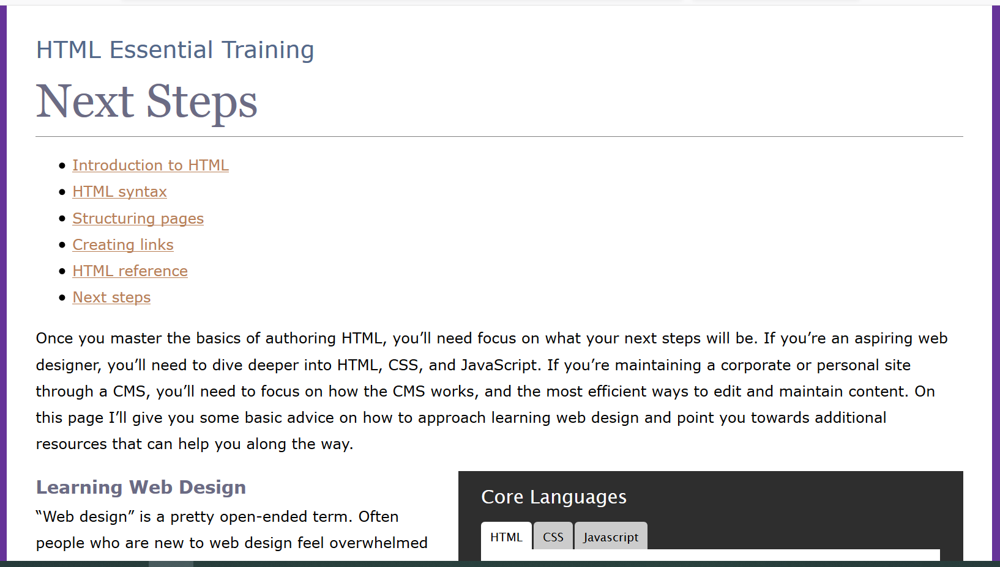
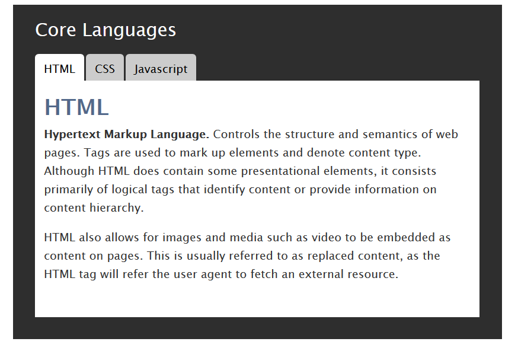
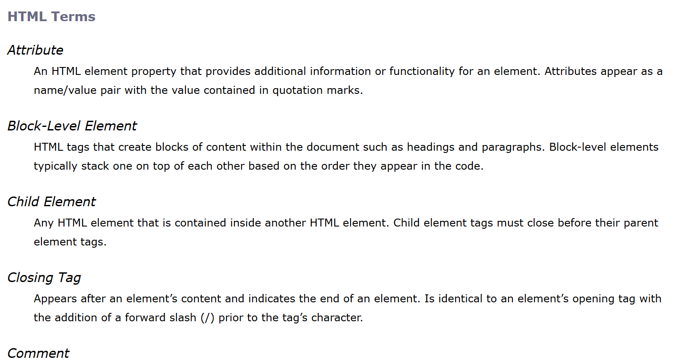

This is lessons on HTML by James Williamson(https://www.lynda.com/HTML-tutorials/HTML-Essential-Training/170427-2.html). 
The ideas from behind was to get more used to Javascript, HTML, and CSS before jumping back to React.

Lessons:

<ul>
	<li>Formatting Page Strucutres</li>
	<li>Displaying images</li>
	<li>Using nav, article, and div elements</li>
	<li>Linking to pages and downloadable content</li>
	<li>Creating lists</li>
	<li>Controlling styling (fonts, colors, and more)</li>
	<li>Writing basic scripts</li>
</ul>

To run the web pages, navigate to 

Ex_Files_HTML_EssT\site  

and open one of the htm files with a browser. 

Here is a basic page strucutre(next.htm)

Here is a tab that controls by javascript

Here is a Description List(dl)

Ren Li
7/24/2018
